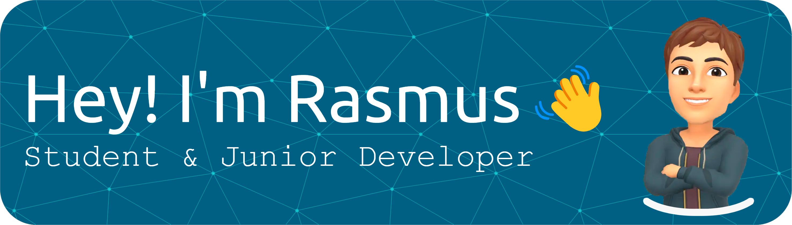

# Greetings! 
I'm Rasmus, currently in my third semester at the IT-University in Copenhagen, pursuing a Bachelor's degree in Software Development.

## Platforms I use

## Languages and tools i use

## Currently learning

## Looking forward to learn

## Github Stats

